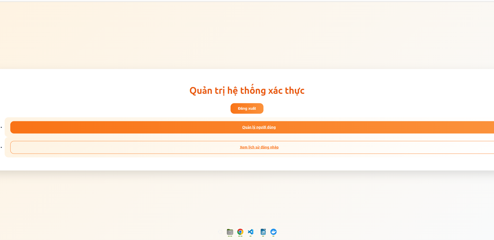
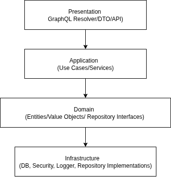
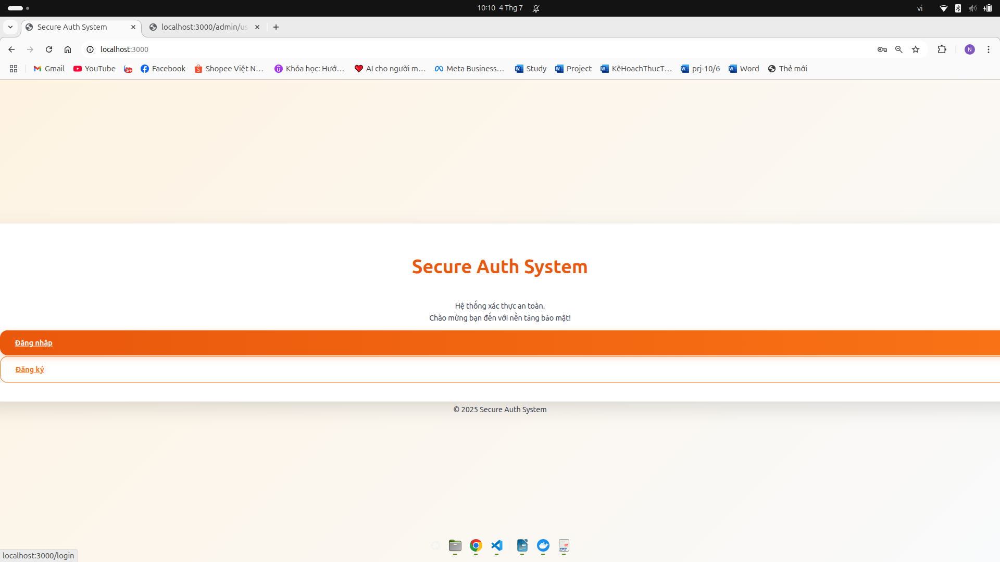

# 🔒 Ứng Dụng SHA và Triple DES Để Bảo Vệ Mật Khẩu Người Dùng Trong Cơ Sở Dữ Liệu

<div align="center">
  
  
</div>

<div align="center">
  
</div>

<div align="center">

[](https://nodejs.org)
[](https://www.typescriptlang.org)
[](LICENSE)
[](https://fit.dainam.edu.vn)
[](https://dainam.edu.vn)
[](https://github.com/dainam-secure-auth/SecureAuth)

</div>

<h3 align="center">🔐 Bảo Vệ Mật Khẩu Người Dùng Với Công Nghệ Mã Hóa Tiên Tiến</h3>

<p align="center">
  <strong>Hệ thống xác thực an toàn sử dụng SHA-256, Salt và Triple DES cho học phần An toàn, Bảo mật Thông tin</strong>
</p>

---

## 📋 Mục Lục

- [🏗️ Kiến Trúc Hệ Thống](#kiến-trúc-hệ-thống)
- [✨ Tính Năng Chính](#tính-năng-chính)
- [🔧 Công Nghệ Sử Dụng](#công-nghệ-sử-dụng)
- [📂 Cấu Trúc Thư Mục](#cấu-trúc-thư-mục)
- [📥 Cài Đặt](#cài-đặt)
- [▶️ Chạy Ứng Dụng](#chạy-ứng-dụng)
- [📈 Hiệu Suất và Bảo Mật](#hiệu-suất-và-bảo-mật)
- [🤝 Đóng Góp](#đóng-góp)
- [📜 Giấy Phép](#giấy-phép)
- [📬 Liên Hệ](#liên-hệ)

---

## 🏗️ Kiến Trúc Hệ Thống

<div align="center">
  
</div>

Hệ thống được thiết kế theo mô hình **Clean Architecture**, sử dụng **NestJS + GraphQL** cho backend, **Next.js + Apollo Client** cho frontend, và **MongoDB** làm cơ sở dữ liệu, đảm bảo **bí mật**, **toàn vẹn**, và **sẵn sàng** của dữ liệu người dùng.

### 🔐 Quy trình mã hóa và xác thực:

1. **Người dùng nhập thông tin đăng ký/đăng nhập**:
   - Username và password được gửi qua giao diện frontend.
2. **Sinh Salt ngẫu nhiên**:
   - Tạo chuỗi Salt (16-32 byte) riêng biệt cho mỗi người dùng.
3. **Băm bằng SHA-256**:
   - Hash1 = SHA-256(password + Salt).
   - Hash2 = SHA-256(username).
   - FinalHash = SHA-256(Hash1 + Hash2).
4. **Mã hóa bằng Triple DES**:
   - Sử dụng khóa 192-bit và vector khởi tạo (IV) ở chế độ CBC.
   - EncryptedPassword = TripleDES.encrypt(FinalHash, key, IV).
5. **Lưu trữ vào MongoDB**:
   - Lưu `{username, salt, encryptedPassword, failAttempts, isLocked}`.
6. **Xác thực đăng nhập**:
   - Truy xuất Salt và encryptedPassword từ MongoDB.
   - Tái mã hóa password nhập vào theo quy trình trên.
   - So sánh với encryptedPassword lưu trữ.
   - Xử lý failAttempts, khóa tài khoản nếu sai ≥ 5 lần.
7. **Quản trị viên**:
   - Xem danh sách người dùng, mở khóa tài khoản, theo dõi log đăng nhập.

---

### ⚙️ Các thành phần chính

#### 🔑 Mã hóa và xác thực
- **SHA-256**: Hàm băm một chiều, đảm bảo không thể đảo ngược.
- **Salt ngẫu nhiên**: Tăng tính duy nhất, chống rainbow table.
- **Triple DES**: Mã hóa đối xứng, bảo vệ FinalHash.
- **JWT**: Xác thực người dùng trên frontend.

#### 🌐 Giao tiếp client-server
- **NestJS + GraphQL**: Backend xử lý logic nghiệp vụ và API.
- **Next.js + Apollo Client**: Frontend giao tiếp với backend qua GraphQL.
- **MongoDB**: Lưu trữ dữ liệu người dùng và log.

---

## ✨ Tính Năng Chính

### 🔐 Bảo Mật Toàn Diện

| Tính Năng            | Mô Tả                                           | Công Nghệ                  |
|----------------------|-------------------------------------------------|----------------------------|
| **Mã Hóa Mật Khẩu**  | Bảo vệ mật khẩu khỏi rò rỉ                     | SHA-256, Triple DES, Salt  |
| **Xác Thực Người Dùng** | Xác minh danh tính, khóa tài khoản khi cần   | JWT, failAttempts, isLocked |
| **Kiểm Tra Toàn Vẹn** | Đảm bảo mật khẩu không bị thay đổi trái phép   | SHA-256                    |
| **Quản Trị Hệ Thống** | Quản lý tài khoản và log đăng nhập             | GraphQL, MongoDB           |

### ⚡ Hiệu Suất Cao

- **🖥️ Giao Diện Web**: Next.js với render phía server (SSR), tối ưu tốc độ.
- **🔄 GraphQL API**: Giảm lưu lượng dữ liệu, tăng tốc phản hồi.
- **⚠️ Error Management**: Xử lý lỗi đăng nhập, khóa tài khoản tự động.
- **📊 Real-time Updates**: Cập nhật trạng thái tài khoản và log theo thời gian thực.

### 📱 Giao Diện Thân Thiện

<div align="center">
  
</div>

- **💻 Giao Diện Người Dùng**: Đăng ký, đăng nhập, đổi mật khẩu dễ sử dụng.
- **🔐 Giao Diện Admin**: Xem danh sách user, log, mở khóa/xóa tài khoản.
- **🔔 Notifications**: Thông báo lỗi, trạng thái tài khoản.
- **🔄 Password Change**: Đổi mật khẩu an toàn với Salt mới.

---

## 🔧 Công Nghệ Sử Dụng

<div align="center">

### Backend Technologies
[](https://nodejs.org/)
[](https://nestjs.com/)
[](https://www.mongodb.com/)
[](https://graphql.org/)

### Security & Cryptography
[](https://en.wikipedia.org/wiki/SHA-2)
[](https://en.wikipedia.org/wiki/Triple_DES)
[](https://jwt.io/)

### Frontend
[](https://nextjs.org/)
[](https://reactjs.org/)
[](https://www.typescriptlang.org/)
[](https://tailwindcss.com/)

</div>

---

## 📂 Cấu Trúc Thư Mục

```plaintext
secure_auth/
├── .venv/                      # Môi trường ảo (Virtual Environment)
├── backend/                   # Source code backend
│   ├── src/
│   │   ├── database/          # Cấu hình kết nối MongoDB
│   │   ├── security/          # Mã hóa SHA-256, Triple DES, Salt
│   │   ├── resolvers/         # GraphQL resolvers (user, admin)
│   │   ├── guards/            # Role guard, auth guard
│   │   ├── entities/          # User entity, value objects
│   │   ├── use-cases/         # Logic nghiệp vụ (register, login, etc.)
│   │   ├── main.ts            # Khởi chạy NestJS
│   │   └── schema.gql         # Lược đồ GraphQL
├── frontend/                  # Source code frontend
│   ├── src/
│   │   ├── pages/             # Route: login, register, admin
│   │   ├── components/        # Thành phần giao diện tái sử dụng
│   │   ├── apollo/            # Cấu hình Apollo Client
│   │   ├── utils/             # Hàm tiện ích (auth, token)
│   │   └── styles/globals.css # CSS toàn cục (Tailwind)
├── ./static/
│   ├── img/
│   │   ├── banner.png        # Banner ứng dụng
│   │   ├── logo-dainam.png   # Logo Đại học Đại Nam
│   │   ├── logo-khoa-cntt.png # Logo Khoa CNTT
│   │   ├── architecture-diagram.png # Sơ đồ kiến trúc
│   │   ├── interface.png      # Giao diện hệ thống
│   │   └── demo.gif          # Demo ứng dụng
├── docker-compose.yml         # Cấu hình Docker
├── package.json              # Dependencies frontend/backend
├── tsconfig.json             # Cấu hình TypeScript
└── README.md                 # Tài liệu hướng dẫn


📥 Cài Đặt
🛠️ Yêu Cầu Hệ Thống

Node.js: 18.x trở lên
MongoDB: 5.0 trở lên
RAM: Tối thiểu 4GB
Dung lượng: 1GB trống
Mạng: Kết nối Internet cho GraphQL API

⚙️ Thiết Lập Dự Án

Sao chép repository:
git clone https://github.com/kazano77/SHA3DES.git
cd SecureAuth


Cài đặt dependencies backend:
cd backend
npm install


Cài đặt dependencies frontend:
cd frontend
npm install


Cấu hình môi trường:

Tạo file .env trong thư mục backend:MONGODB_URI=mongodb://localhost:27017/secure_auth


Tạo khóa Triple DES (24 byte):node -e "console.log(require('crypto').randomBytes(24).toString('hex'))"


Cập nhật endpoint GraphQL trong frontend/src/apollo/client.ts.


Cài đặt MongoDB:

Đảm bảo MongoDB đang chạy trên localhost:27017 hoặc cập nhật URI trong .env.


▶️ Chạy Ứng Dụng
🚀 Khởi Động

Chạy MongoDB:
docker-compose up -d mongodb


Chạy backend:
cd backend
npm run start:dev
# Output mong đợi:
# Nest application successfully started on http://localhost:3000


Chạy frontend:
cd frontend
npm run dev
# Output mong đợi:
# Ready in http://localhost:3001


🌐 Truy Cập

Mở trình duyệt: http://localhost:3001
Đăng ký/Đăng nhập: Sử dụng giao diện để tạo tài khoản hoặc đăng nhập.
Admin Dashboard: Truy cập http://localhost:3001/admin/login để quản lý.

📺 Demo

  


Nhấp vào hình ảnh để xem video demo đầy đủ

📈 Hiệu Suất và Bảo Mật
🔒 Đánh Giá Bảo Mật


Thành Phần
Mức Độ Bảo Mật
Ghi Chú


SHA-256
⭐⭐⭐⭐⭐
Không thể đảo ngược, chống collision


Triple DES
⭐⭐⭐⭐
An toàn, nhưng chậm hơn AES


Salt
⭐⭐⭐⭐⭐
Chống rainbow table, tính duy nhất


JWT
⭐⭐⭐⭐
Bảo vệ route nhạy cảm


⚡ Hiệu Suất

Encryption Speed: SHA-256 băm nhanh, Triple DES ~1ms cho chuỗi ngắn.
Authentication Latency: <100ms trên máy chủ phổ thông.
Query Performance: MongoDB với index, <200ms cho vài nghìn bản ghi.
Memory Usage: ~100MB RAM cho backend/frontend.

🔧 Khuyến Nghị Cải Thiện

Mã hóa: Thay Triple DES bằng AES-256 để tăng tốc độ và bảo mật.
Bảo mật: Tích hợp xác thực đa yếu tố (MFA/OTP).
Hiệu suất: Thêm caching (Redis) và sharding cho dữ liệu lớn.
Khả năng mở rộng: Sử dụng connection pooling và load balancing.


🤝 Đóng Góp
Chúng tôi hoan nghênh mọi đóng góp! Vui lòng làm theo quy trình sau:
📝 Quy Trình Đóng Góp

Fork repository:
git clone https://github.com/kazano77/SHA3DES.git


Tạo nhánh feature:
git checkout -b feature/tính-năng-mới


Commit thay đổi:
git commit -m "feat: thêm tính năng XYZ"


Push lên GitHub:
git push origin feature/tính-năng-mới


Tạo Pull Request trên GitHub.


🎯 Hướng Dẫn Đóng Góp

Code Style: Tuân thủ chuẩn TypeScript, ESLint.
Documentation: Cập nhật README và tài liệu API.
Testing: Viết unit tests cho các use case mới.
Security: Báo cáo lỗi bảo mật qua email riêng.


📜 Giấy Phép
MIT License

Copyright (c) 2025 Khoa Công Nghệ Thông Tin, Đại Học Đại Nam

Permission is hereby granted, free of charge, to any person obtaining a copy
of this software and associated documentation files (the "Software"), to deal
in the Software without restriction, including without limitation the rights
to use, copy, modify, merge, publish, distribute, sublicense, and/or sell
copies of the Software, and to permit persons to whom the Software is
furnished to do so, subject to the following conditions:

The above copyright notice and this permission notice shall be included in all
copies or substantial portions of the Software.

THE SOFTWARE IS PROVIDED "AS IS", WITHOUT WARRANTY OF ANY KIND, EXPRESS OR
IMPLIED, INCLUDING BUT NOT LIMITED TO THE WARRANTIES OF MERCHANTABILITY,
FITNESS FOR A PARTICULAR PURPOSE AND NONINFRINGEMENT. IN NO EVENT SHALL THE
AUTHORS OR COPYRIGHT HOLDERS BE LIABLE FOR ANY CLAIM, DAMAGES OR OTHER
LIABILITY, WHETHER IN AN ACTION OF CONTRACT, TORT OR OTHERWISE, ARISING FROM,
OUT OF OR IN CONNECTION WITH THE SOFTWARE OR THE USE OR OTHER DEALINGS IN THE
SOFTWARE.


Dựa trên yêu cầu của bạn, tôi sẽ cập nhật phần Nhóm Phát Triển trong file README.md bằng cách bỏ các cột Email và GitHub, giữ lại chỉ Vai Trò và Họ và Tên. Thời gian hiện tại là 12:01 AM +07, Thứ Hai, ngày 07/07/2025. Dưới đây là nội dung đã chỉnh sửa:

📬 Liên Hệ
👥 Nhóm Phát Triển

Vai Trò	         Họ và Tên
Project Lead	Nguyễn Phương Nam
Frontend Dev    Phạm Ngọc Minh
Report	     	 Nguyễn Văn Nam
Report	       Đào Hải Phong

                     🏫 Liên Hệ Khoa
Khoa Công Nghệ Thông Tin - Đại Học Đại Nam, Hà Nội, Việt Nam

⭐ Nếu project này hữu ích, hãy star để ủng hộ nhóm phát triển!


```